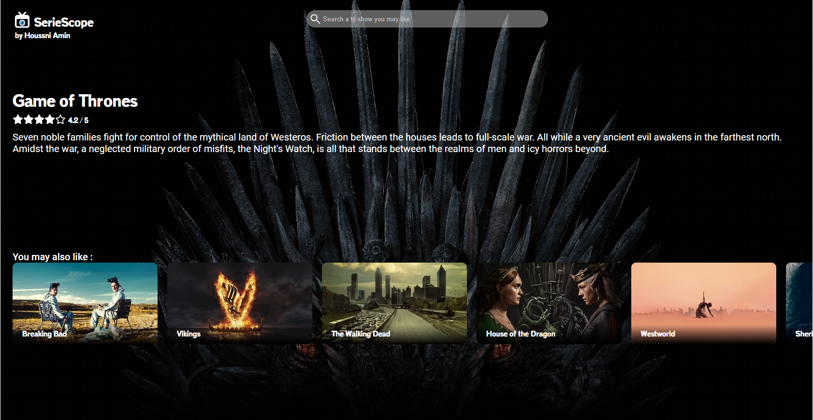

# SerieScope

(Verson desktop)

## Description

SerieScope est une application React permettant de rechercher et de découvrir des séries via une API. Le projet inclut une interface utilisateur réactive, une barre de recherche dynamique et des détails pour chaque série.

## Technologies utilisées

- React
- API
- HTML
- CSS

## Fonctionnalités

- Recherche de séries via une API
- Interface utilisateur réactive
- Barre de recherche dynamique
- Affichage des détails pour chaque série

## Aperçu

